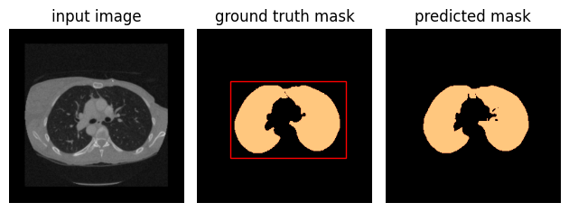

## Fine-Tuning SAM Model with Bounding Box Prompts for Lung Segmentation on CT Images

This repository contains a step-by-step tutorial for fine-tuning the Segment Anything Model (SAM), a powerful transformer architecture from Hugging Face, using bounding box prompts for lung segmentation on Computed Tomography (CT) images. The goal is to take advantage of this pretrained model and apply it to a more specific task - lung segmentation, which is crucial for diagnosing and understanding a wide range of pulmonary diseases.


## Advantages of Transfer Learning
Transfer learning is a machine learning method where a pre-trained model is used on a new problem. It's popular in deep learning because it allows us to build accurate models in a timesaving way:

• Pre-trained models are a time-saver: These models are trained on extensive data sets and take a significant amount of time to train. By using pre-trained models, we leverage the features learned from those large data sets and save considerable time and computational resources.

• Out-of-the-box use: Pre-trained models can be used for out-of-the-box inference if you're only interested in categorizing images.

• Leverage existing architecture: With transfer learning, we also leverage established architectures that have been designed by experts and proven to work well for image classification tasks.

• Good for small data: Transfer learning is beneficial when we have a small data set. In medical imaging, where data acquisition is challenging and expensive, it is often the case. Instead of training a full-scale model from scratch, which might lead to overfitting, we can fine-tune pre-trained models that have already learned useful features from vast amounts of data.

This tutorial will guide you through the process of fine-tuning the SAM model on a small set of CT images for lung segmentation. We will employ the Hugging Face Transformers library, a widely-used library for pre-trained models.

<p align="center">
  
</p>

# Getting Started
## Prerequisites
MONAI, a PyTorch-based, open-source framework for deep learning in healthcare imaging.
```bash
pip install monai
```
SimpleITK, an interface to the Insight Toolkit (ITK), a biomedical image processing library.
```bash
pip install SimpleITK
```
Transformers library from HuggingFace
```bash
pip install git+https://github.com/huggingface/transformers.git
```

## Download Dataset
Our dataset for this project will be fetched from Kaggle using an API token
```bash
pip install kaggle
```
Next, you will need to authenticate with the Kaggle API using an API token. To create a new token:

Go to the Kaggle website and log into your account.
Click on your profile picture at the top-right of the page, then click "My Account".
Scroll down to the API section and click "Create New API Token". This will download a file named `kaggle.json`.
You need to place this file in the location `~/.kaggle/kaggle.json` on your machine. Here's how you can do this:
```bash
mkdir ~/.kaggle
mv /path/to/downloaded/kaggle.json ~/.kaggle/
chmod 600 ~/.kaggle/kaggle.json
```

Now you can use the Kaggle API to download datasets. Alternatively, you can run the code provided in Google Colab.

## Data Split and Preparation
Following the steps provided in the script, you can split the data, perform necessary transformations, and prepare it for the model training. We use `SamProcessor` for image preprocessing and `SAMDataset` class for managing the dataset.

## Model Finetuning
For model fine-tuning, freeze the encoder weights from the pre-trained SAM model. Continue with the fine-tuning as required by your specific project.

## Inference and Visualization
You can perform predictions on test data and visualize your lung segmentations. Check the provided script for the code snippet.


### References
1. [https://huggingface.co/docs/transformers/main/en/model_doc/sam](https://huggingface.co/docs/transformers/main/en/model_doc/sam)

2. [https://github.com/bowang-lab/MedSAM](https://github.com/bowang-lab/MedSAM)

3. [https://github.com/NielsRogge/Transformers-Tutorials/blob/master/SAM/Fine_tune_SAM_(segment_anything)_on_a_custom_dataset.ipynb](https://github.com/NielsRogge/Transformers-Tutorials/blob/master/SAM/Fine_tune_SAM_(segment_anything)_on_a_custom_dataset.ipynb)

